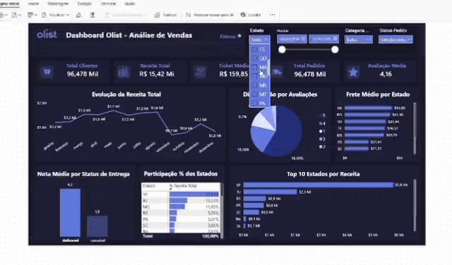
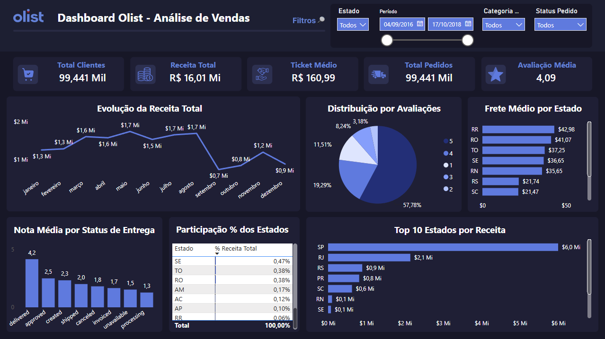

# 📊 E-commerce Olist Data Analysis

Projeto de Análise de Dados desenvolvido a partir do Brazilian E-Commerce Public Dataset by Olist (Kaggle), com o objetivo de identificar os principais fatores que impactam a receita e a satisfação dos clientes em um e-commerce.

A análise tem foco em aspectos como eficiência logística, comportamento de compra e distribuição geográfica, gerando insights que apoiam a tomada de decisões estratégicas orientadas por dados.

## 🔹 Contexto

O crescimento do e-commerce no Brasil trouxe novas oportunidades de expansão para as empresas, ao mesmo tempo em que aumentou a complexidade das operações. Nesse cenário, torna-se fundamental compreender quais fatores realmente influenciam o desempenho do negócio, tanto do ponto de vista financeiro quanto da satisfação dos clientes.

## 🔹 Problema

Apesar do alto volume de pedidos, a empresa ainda não possui clareza sobre quais fatores impulsionam a receita e influenciam a satisfação dos clientes. 

## 🔹 Pergunta de negócio

Quais fatores impactam a receita e a satisfação do cliente?

### 🔹 Perguntas analíticas

- Qual é a correlação entre o status da entrega e a nota de avaliação dos clientes?
- Qual é o ranking dos estados por receita total?
- Quais meses do ano vendem mais?
- O frete influencia na avaliação do cliente?

## 🔹 Sobre o Dataset

O dataset possui 9 tabelas contendo informações acerca de clientes, pedidos, vendedores, produtos e geolocalização.

📌 Tabelas
- customers
- geolocation
- order_items
- order_payments
- order_reviews
- orders
- product_category_name_translation
- products
- sellers

---

## 🛠️ Tecnologias Utilizadas


- **SQL** & **PostgreSQL** → ETL e Análise Exploratória de Dados
- **Power BI** & **DAX** → criação de métricas, KPIs e dashboard interativo
- **Figma** → prototipação do layout do dashboard

---

## 🔹 Arquitetura do Projeto

```
Kaggle (CSV)
     ↓
PostgreSQL (ETL + EDA)
     ↓
Power BI (DAX)
     ↓
Dashboard Interativo
```

---

## 📁 Estrutura do Projeto
```
brazilian-e-commerce-olist-analysis/
│
├── data/
│   └── olist_customers_dataset
│   └── olist_geolocation_dataset
│   └── olist_order_items_dataset
│   └── olist_order_payments_dataset
│   └── olist_order_reviews_dataset
│   └── olist_orders_dataset
│   └── olist_products_dataset
│   └── olist_sellers_dataset
│   └── product_category_name_translation
│
├── sql/
│   └── 01_create_table.sql
│   └── 02_eda.sql
│   └── 03_analysis.sql
│
├── dashboard/
│   └── dashboard_olist.pbix
│
├── docs/
│   ├── layout_dashboard_olist.png
│   ├── print_dashboard_olist.png
│   └── dashboard_olist.gif
│ 
└── README.md
```

---

## 🔹 EDA (PostgreSQL)

- **Criação do schema e importação dos dados** - Estruturação das 9 tabelas do dataset Olist no PostgreSQL
- **Limpeza e tratamento** - Verificação de valores nulos, duplicados e inconsistências
- **Análise exploratória** - Distribuição de pedidos por status, período de vendas (2016-2018), categorias mais frequentes
- **Cálculo de métricas iniciais** - Total de pedidos, receita total, ticket médio

---

## 🔹 Dashboard (Power BI)



O dashboard foi desenvolvido com foco em análise exploratória, permitindo identificar padrões de venda e compra.

- Filtros disponíveis: Estado, Período, Categoria Produto e Status Pedido.

💡 Esses filtros permitem ao usuário analisar subconjuntos específicos!

### Dashboard Olist - Análise de Vendas



**KPIs**
- Total Clientes
- Receita Total
- Ticket Médio
- Total Pedidos
- Avaliação Média

**Gráficos**
- Evolução da Receita Total  | Gráfico de Linhas
- Distribuição por Avaliações | Gráfico de Pizza
- Frete Médio por Estado | Gráfico de Barras
- Nota Média por Status de Entrega | Gráfico de Colunas
- Participação % dos Estados | Tabela
- Top 10 Estados por Receita | Gráfico de Barras

## 💡 Principais Insights

### Distribuição Geral

- O dataset contém informações dos anos de 2016 a 2018.
- São Paulo (SP) é o estado que mais contribui para a receita total, com 37,47%  do faturamento.
- 57,78% das avaliações são nota 5. A avaliação média geral é 4,09.
- 5 estados (SP, RJ, MG, RS, PR) concentram 73,2% da receita total.

### Evolução da Receita Total
- O maior pico de vendas acontece no mês de agosto, com pico de pedidos e receita elevada.
- Após agosto as vendas caem, mas voltam a ter um pequeno pico em novembro, deduzindo-se que seja por causa das promoções da Black Friday.
- Setembro, outubro e dezembro possuem o menor volume de vendas.

### Status de Entrega X Avaliação
- Pedidos entregues possuem a maior avaliação média: 4,2.
- Pedidos com status canceled e unavailable têm notas abaixo de 1,9.
- A diferença de 2,4 pontos entre entregues e cancelados mostra que a logística é o fator mais crítico para a satisfação do cliente.

### Frete X Avaliação
- Estados das regiões Norte e Nordeste (RR, RO, TO) possuem os maiores fretes médios.
- Roraima (RR) tem frete 2x maior que o Rio Grande do Sul (RS).
- Clientes que pagam fretes mais altos tendem a ser mais críticos, mostrando que o alto custo de frete em algumas regiões pode ser um fator que contribui para a insatisfação.

---

## 🔹 Conclusão

A análise dos dados da Olist permitiu responder à pergunta de negócio: **"Quais fatores impactam a receita e a satisfação do cliente?"**

**Fatores que impactam a receita**
1. **Sazonalidade** - Vendas concentradas em agosto.
2. **Concentração geográfica** - São Paulo lidera com 37,47% do faturamento

**Fatores que impactam a satisfação**
1. **Eficiência logística** - Pedidos entregues têm nota 4,2; cancelados têm 1,8
2. **Custo do frete** - Regiões com frete mais alto tendem a ter maior insatisfação

## 👩‍💻 Sobre mim

Sou Tecnóloga em Sistemas para Internet em transição para a área de Dados, com foco em análise de dados.

Possuo experiência com SQL (PostgreSQL), Python (Pandas) e Power BI, desenvolvendo projetos de ETL, análise exploratória (EDA) e criação de dashboards interativos.

---

🩷 Fique à vontade para explorar o projeto, dar feedback ou entrar em contato!

---
## 📫 Contato

<p align="left">
    <a href="https://www.linkedin.com/in/ana-carolina-itacarambi-araujo/" target="_blank">
      
    </a>
</p>